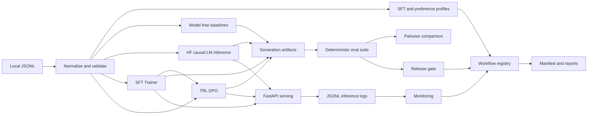

# Architecture

## Purpose

`llm-posttraining-ops` is a compact reference implementation of the systems
around language-model post-training: data contracts, training entry points,
evaluation, serving, monitoring, release gates, and reproducible orchestration.
The repository favors explicit artifacts and dependency boundaries over a large
framework abstraction.

## System overview



## Package boundaries

| Package | Responsibility |
| --- | --- |
| `data` | JSONL I/O, normalization, schemas, validation, and profiling |
| `evaluation` | Model-free baselines, deterministic metrics, pairwise comparison, reports |
| `inference` | Prompt construction, Hugging Face generation, latency-aware evaluation |
| `training` | Trainer-based SFT, TRL DPO, LoRA configuration, checkpoint evaluation |
| `serving` | FastAPI schemas, lazy model management, mock generation, inference logs |
| `monitoring` | Log aggregation, threshold checks, regression gates |
| `workflows` | Stage orchestration, experiment registry, manifests, final reports |

The CLI is intentionally a thin adapter over these modules. Core behavior is
callable from Python and testable without invoking subprocesses.

## Artifact model

Every substantial operation writes a human-inspectable JSON, JSONL, or Markdown
artifact. End-to-end runs are isolated under:

```text
artifacts/runs/<run_id>/
├── data/
├── evals/
├── models/
├── reports/
├── experiment_registry.json
├── reproducibility_manifest.json
└── workflow_summary.json
```

Large or transient artifacts are ignored by Git. Small deterministic fixtures
and portfolio reports are tracked.

## Reproducibility and failure handling

- Data generation, normalization, mock inference, and local evaluation are
  deterministic for fixed inputs and seeds.
- Generation settings and training settings are serialized with artifacts.
- The manifest captures Python, package, dependency, platform, model, data, and
  Git provenance.
- Each workflow stage is persisted as running, passed, failed, or skipped.
- A failed workflow still finalizes its registry, manifest, summary, and report.
- CI exercises the complete no-download workflow path.

## Production-shaped versus intentionally small

Production-shaped elements include typed schemas, lazy loading, adapter
resolution, stage isolation, structured logging, percentile monitoring, and
regression gates. Fixtures, model sizes, training steps, and deterministic
heuristics are intentionally small so the repository remains CPU-testable.
